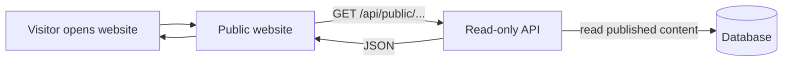
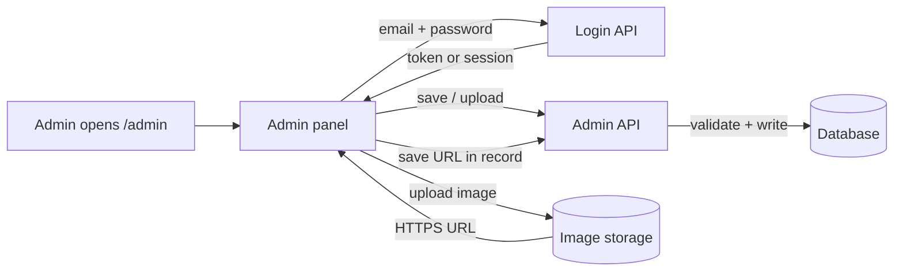

# Product Requirements Document (PRD)  
## Trackzio CMS Backend & Admin Panel

**Who should read this**

| Audience | What to read |
|----------|----------------|
| **Product, marketing, ops** | [§1 At a glance](#1-at-a-glance), [§2 Plain-language overview](#2-plain-language-overview-for-non-developers), [§3 How the flow works](#3-how-the-flow-works), [§5 What admins can do](#5-what-admins-can-do-features) |
| **Engineers** | Full document; **schemas & endpoints** in [`cms-and-admin-spec.md`](./cms-and-admin-spec.md); **flows, behavior & edge cases** in [`backend-api-flow-and-edge-cases.md`](./backend-api-flow-and-edge-cases.md) |

**Document purpose:** Describe *what* we are building and *why*, in language both stakeholders and developers can follow. The companion spec is the *how* (field-by-field, endpoint-by-endpoint). The backend flow doc is *when things break or overlap* (auth, publishing, references, uploads, serverless).

---

## 1. At a glance

**What we’re building**

A **content management system (CMS)** for the Trackzio marketing website. Today, text and images live inside code files (`appData.ts`, `blogData.ts`, etc.). After this project, **approved team members** update content through a **password-protected Admin** area. The **public website** reads that content from an **API**—so most updates **do not require** redeploying the whole site.

**In one sentence**

> Admins edit content in `/admin` → it is saved in a database → visitors see it on the marketing site when they load the page (within a short cache window).

**What stays the same for visitors**

They still use the same website URL and pages (Home, Apps, Blog, Careers, Team). The pages just load **dynamic** content instead of **fixed** content from the codebase.

---

## 2. Plain-language overview (for non-developers)

### 2.1 The three “places”

1. **Public website** — What customers and candidates see. No login. Fast and read-only.
2. **Admin panel** — Internal tool at `/admin`. Login required. This is where you add apps, posts, jobs, team photos, and choose which apps appear on the homepage.
3. **Backend (API)** — Invisible “middle layer.” It saves data to the database, checks passwords, and serves the right content to the website and admin. *You don’t open this like a website; it powers everything.*

### 2.2 Where files (images) go

Photos and logos are **not** stored inside the website code. They go to **file storage** (e.g. Cloudinary or S3). The database only stores the **link (URL)** to each image. That keeps the site fast and makes images easy to replace.

### 2.3 “Published” vs “Draft”

- **Draft** (`published = false`) — Saved in the system but **hidden** from the public site. Good for work in progress.
- **Live** (`published = true`) — Visible on the public site (subject to caching—see below).

### 2.4 Why changes might not appear for 1–2 minutes

We may **cache** public content at the edge (CDN) so the site stays fast. That means a tiny delay between “I clicked Publish” and “everyone in the world sees it.” Admin always sees fresh data. *Target:* updates visible within the agreed cache window (e.g. 1–5 minutes), or instantly if we tune cache lower.

---

## 3. How the flow works

### 3.1 Big picture (visitor)



**Plain English:** The visitor’s browser asks the API for “published apps, blog posts, jobs…” The API reads the database and sends back JSON. The React site draws the UI from that data.

---

### 3.2 Big picture (admin updating content)



**Plain English:** Admin logs in. The backend confirms identity. When they save an article or upload a logo, the **Admin API** writes to the database (and images go to storage first, then the URL is saved). The public site does not talk to the Admin API—only to the **read-only** public API.

---

### 3.3 Step-by-step: publishing a new blog post

| Step | Who | What happens |
|------|-----|----------------|
| 1 | Admin | Opens `/admin`, logs in with email/password. |
| 2 | Admin | Creates a new post: title, excerpt, body, category, cover image. |
| 3 | Admin | Uploads cover image → file goes to **storage** → admin UI receives an **HTTPS URL**. |
| 4 | Admin | Saves as **draft** (`published = false`) to preview internally, or toggles **Publish**. |
| 5 | Backend | Validates data, stores row in `blog_posts`, sets `publishedAt` if publishing. |
| 6 | Visitor | Opens Blog page → site calls **public** API → only `published = true` posts return. |
| 7 | Visitor | Opens a post URL → site loads that post by **slug**. |

---

### 3.4 Step-by-step: changing homepage featured apps

| Step | Who | What happens |
|------|-----|----------------|
| 1 | Admin | Opens **Homepage settings** (or equivalent screen). |
| 2 | Admin | Sees list of **published** apps; drags to reorder or selects featured set. |
| 3 | Admin | Saves. |
| 4 | Backend | Saves `featuredAppIds` order in **site settings**; rejects unpublished or missing apps. |
| 5 | Visitor | Loads home → public API returns settings + app details → carousel matches new order. |

---

### 3.5 What talks to what (security)

| From | To | Allowed? |
|------|-----|----------|
| Public website | `/api/public/*` | Yes (read only) |
| Public website | `/api/admin/*` | No (must reject) |
| Admin panel | `/api/auth/*` | Yes (login) |
| Admin panel | `/api/admin/*` | Yes, **only with valid login** |
| Random internet user | `/api/admin/*` | No — **401 / 403** |

---

## 4. Goals & success criteria

### 4.1 Primary goals

| Goal | Meaning |
|------|---------|
| **Dynamic content** | Marketing can change copy, images, jobs, and team without a developer editing React files. |
| **Secure writes** | Only authenticated admins can create/update/delete; passwords hashed; admin routes rate-limited. |
| **Fast reads** | Public pages get data from a read-only API with caching; target **p95 &lt; 500ms** for public reads under normal load. |
| **Fewer redeploys** | Content changes do not require a new frontend build for each typo or new job posting. |

### 4.2 Success metrics

- Admin can **CRUD** (create, read, update, delete/unpublish) all main entities without engineering help (after short training).
- Public site reflects changes within the **agreed cache window** (or immediately if cache disabled in dev).
- **No** successful unauthorized calls to `/api/admin/*` in production (monitoring/alerts).
- Public API **p95 latency &lt; 500ms** under expected traffic (tune with indexes and caching).

---

## 5. What admins can do (features)

### 5.1 Authentication

- Log in with **email + password**.
- Session via **JWT** or **httpOnly cookie** (implementation choice).
- Session expires; admin must log in again.
- **Rate limiting** on login to reduce password guessing.

**API:** `POST /api/auth/login` (see technical spec for logout / “me” if needed).

---

### 5.2 Apps (products on Apps page & app detail)

- Add / edit / remove apps (prefer **unpublish** instead of hard delete when possible).
- Upload **logo** and **screenshots** (URLs stored in DB).
- Set **order** for listing; **publish / unpublish**.

**Main fields:** `id` (slug), `name`, `tagline`, `description`, `color`, `accentHsl`, `logoUrl`, `iosUrl`, `androidUrl`, `screenshotUrls[]`, `features[]`, `stats`, `order`, `published`.

---

### 5.3 Homepage

- Choose which apps appear on the home **carousel / showcase**.
- **Reorder** them.
- **Rule:** only **published** apps can be featured (backend validates).

---

### 5.4 Blog

- Create / edit posts; **draft** vs **published**.
- Assign **category**; upload **cover image**.
- Optional: mark **featured**; set **blog of the day** (single spotlight—see technical spec).

**Main fields:** `slug`, `title`, `excerpt`, `body`, `categorySlug`, `coverImageUrl`, `publishedAt`, `authorName`, `featured`, `published`.

---

### 5.5 Blog categories

- Add / edit / delete categories (delete may be blocked if posts still use the category).
- **Reorder** for filters/navigation.

---

### 5.6 Careers

- Add / edit / remove job postings.
- Set title, description, location, employment type, apply link.
- **Publish / unpublish**.

---

### 5.7 Team

- Add / edit / remove members.
- Upload **photo**; set name, role, LinkedIn.
- **Reorder** grid.

---

## 6. Technical architecture (for developers)

### 6.1 Stack (as proposed)

| Piece | Technology |
|-------|------------|
| Public + Admin UI | Vite + React (same repo; `/admin` lazy-loaded) |
| Backend | **Netlify Functions** (serverless) |
| Database | **MongoDB Atlas** (recommended) |
| File storage | **Cloudinary** / S3 / Firebase Storage |

### 6.2 API split

| Prefix | Who uses it | Auth |
|--------|-------------|------|
| `/api/public/*` | Public website | None |
| `/api/auth/*` | Admin login | N/A |
| `/api/admin/*` | Admin panel only | Required (admin role) |

### 6.3 Public endpoints (read-only, published content only)

These names match the **intent** of the PRD. **Exact paths and payloads** may nest resources (e.g. `/api/public/blog/posts`); implement to match [`cms-and-admin-spec.md`](./cms-and-admin-spec.md).

| Endpoint (conceptual) | Purpose |
|------------------------|---------|
| Apps list & detail | All published apps; single app by id/slug |
| Blog list & post by slug | Paginated/filtered posts; full body for article page |
| Categories | For filters |
| Jobs | Published roles |
| Team | Published members |
| Home / site bootstrap | Featured app ids + optional bundled payload |

**Sorting:** primary `order` ASC where applicable; fallback `updatedAt` DESC where defined.

### 6.4 Admin endpoints

- Full **CRUD** for: apps, site/home settings, blog categories, blog posts, site/blog spotlight, jobs, team.
- **Upload** endpoint(s) for images → return HTTPS URL.
- All guarded by **auth middleware**.

### 6.5 Data rules

| Rule | Detail |
|------|--------|
| **Slugs** | Lowercase, kebab-case, unique (`coinzy`, `small-habits-post`). |
| **Slug after publish** | Treat as **immutable** in product policy (if change needed, create new slug and redirect—implementation detail). |
| **Publishing** | `published: false` = draft; `published: true` = visible on public API. |

### 6.6 Non-functional requirements

| Area | Requirement |
|------|----------------|
| **Performance** | Public read p95 &lt; 500ms; use indexes + CDN cache headers. |
| **Security** | Validate all inputs (e.g. Zod/Joi); hash passwords; no `passwordHash` in responses. |
| **Serverless** | Mitigate cold starts with caching; **reuse DB connections** where Netlify/Mongo patterns allow. |
| **Reliability** | Retries for transient DB errors; structured **logging** for mutations (who/when/what). |

---

## 7. File uploads

- Admin uploads **PNG, JPG, WEBP** (GIF optional—align with spec).
- Files live in **external storage**; DB stores **only URLs**.
- Max size and MIME checks enforced server-side.

---

## 8. Errors (standard shape)

Use one consistent JSON shape so frontend and admins can show clear messages:

```json
{
  "error": {
    "code": "VALIDATION_ERROR",
    "message": "Invalid input",
    "details": {}
  }
}
```

**HTTP status:** `400` validation, `401` not logged in, `403` forbidden, `404` not found, `409` conflict (duplicate slug, invalid featured apps, etc.).

---

## 9. Caching

| API type | Policy |
|----------|--------|
| **Public** | Short CDN cache (e.g. 60–300s `Cache-Control`); Netlify edge where applicable. |
| **Admin** | No cache (`private, no-store`). |

---

## 10. Environment variables (reference)

- Database connection string  
- JWT secret and/or session secret  
- Storage (Cloudinary/S3) keys  
- Public base URL for CORS and links  

*(Exact names per environment in engineering runbook.)*

---

## 11. Implementation plan (phases)

### Phase 1 — Backend (Netlify Functions + MongoDB)

1. Repo/layout for functions, shared validation, DB client.  
2. MongoDB collections + indexes (see technical spec).  
3. Auth: login, middleware, rate limit.  
4. Public read routes (apps, blog, categories, jobs, team, home).  
5. Admin CRUD routes + upload integration.  
6. Seed first admin user (script).  

### Phase 2 — Admin panel (`/admin`)

1. Login screen + session handling.  
2. Dashboard navigation.  
3. CRUD screens per entity + forms validation.  
4. Image upload wired to storage + URL fields.  

### Phase 3 — Public site integration

1. Replace `appData` / `blogData` / hardcoded lists with API hooks.  
2. Loading skeletons and error/retry UI.  
3. Align TanStack Query `staleTime` with CDN cache.  

---

## 12. Risks & mitigations

| Risk | Mitigation |
|------|------------|
| Serverless cold start | Cache public responses; keep functions focused |
| DB connection churn | Connection reuse pattern for serverless + Atlas |
| Broken admin access | Auth tests, monitoring on 401/403 rates |
| Slug collisions | Unique indexes + clear 409 errors |
| Stale content | Document cache TTL for stakeholders; optional lower TTL for blog |

---

## 13. Future enhancements

- **Editor** role (limited permissions)  
- Analytics inside admin  
- Content **version history** / rollback  
- **Scheduled** publish  
- **Multi-language** content  

---

## 14. Glossary

| Term | Simple meaning |
|------|----------------|
| **API** | Machine-readable interface: the website asks for JSON; the server answers. |
| **SPA** | Single Page Application (React loads once; navigation updates content without full page reloads). |
| **CRUD** | Create, Read, Update, Delete (manage records). |
| **CDN / edge cache** | Copies of API responses stored closer to users for speed; short delay before updates propagate. |
| **Slug** | URL-safe id for a post or app (`my-blog-post`). |
| **Serverless** | Backend runs as small functions on demand; no single server you manage 24/7. |

---

## 15. Summary

Trackzio will **manage marketing content through an Admin panel**, backed by **Netlify Functions**, **MongoDB**, and **cloud file storage**. The **public site** only **reads** published data via a **read-only API**, so the team can iterate on messaging, imagery, jobs, and team information **without constant frontend releases**, within an agreed **cache window** for performance.

**Technical deep dive:** [`cms-and-admin-spec.md`](./cms-and-admin-spec.md)

---

| Version | Date | Author / note |
|---------|------|----------------|
| 1.0 | 2026-04-08 | PRD aligned with stakeholder draft; accessibility pass + flow diagrams |
