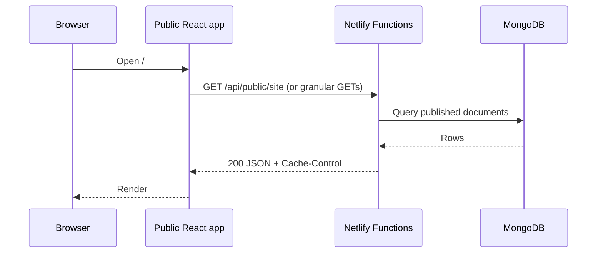
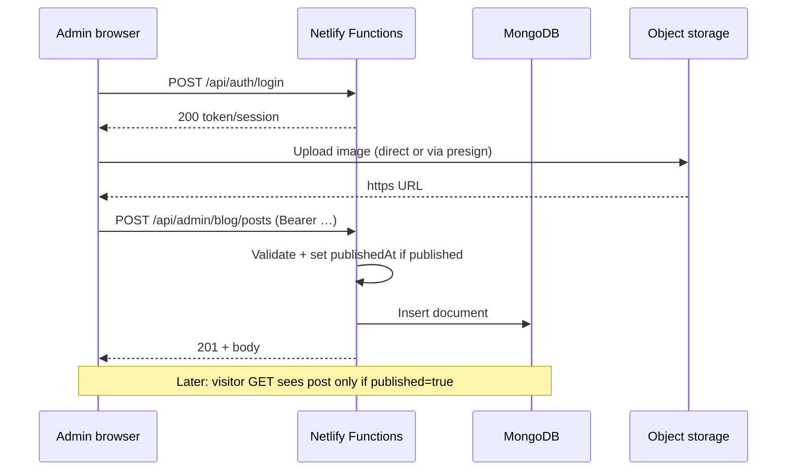
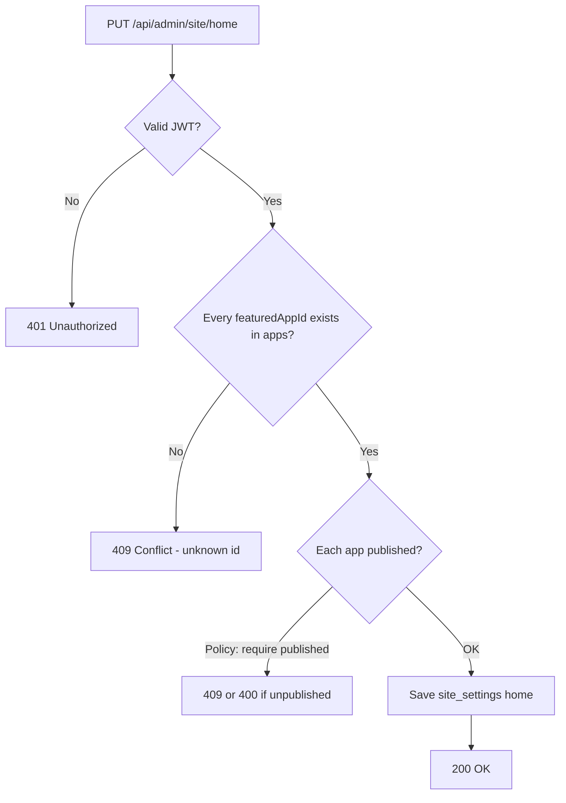

# Trackzio CMS — Backend API: flows, behavior & edge cases

**Purpose:** Explain **how the backend behaves** end-to-end, what can go wrong, and how the API should respond—so **non-technical readers** understand the journey and **engineers** can implement and test consistently.

**Companion documents**

| Document | Use for |
|----------|---------|
| [`PRD-trackzio-cms.md`](./PRD-trackzio-cms.md) | Product goals, stack, phases, glossary |
| [`cms-and-admin-spec.md`](./cms-and-admin-spec.md) | Exact collections, fields, endpoint paths, implementation checklists |

This file focuses on **flows**, **decision rules**, and **edge cases**; field-level schemas stay in the spec above.

---

## How to read this document

| If you are… | Start here |
|-------------|------------|
| **PM, marketing, ops** | [§1 Plain-language story](#1-plain-language-how-the-system-behaves), [§3 Happy-path flows](#3-happy-path-flows-visual), [§12 Glossary](#12-glossary) |
| **Backend / frontend engineer** | [§2 Technical overview](#2-technical-overview), [§4 API surface](#4-api-surface-summary), [§5 Authentication flow & edge cases](#5-authentication-flow--edge-cases), [§6–11](#6-content-crud--publishing-edge-cases) by domain, [§13 Testing checklist](#13-testing-checklist) |

---

## 1. Plain language: how the system behaves

**What the backend does (in one paragraph)**  
When someone on the team logs into the Admin panel, the backend checks their password and issues a short-lived “pass” (token or cookie). After that, every time they save an app, blog post, or job, the backend **validates** the data, **stores** it in the database, and stores **image links** (not the files themselves) in that same record. When a visitor opens the public website, their browser only asks for **read-only** addresses (`/api/public/...`). Those answers never include drafts or unpublished items—only what you marked as **published**.

**Why there are two “doors” (public vs admin)**  
- **Public door:** Anyone can knock; they only get **finished, published** content. Fast and cacheable.  
- **Admin door:** Only people with the right login can enter; they can create drafts, upload files, and publish.

**What “edge cases” mean here**  
Unusual situations—duplicate names, broken links between records, expired login, huge files, two people editing at once—that the system must handle **predictably** (clear errors, no corrupt data).

---

## 2. Technical overview

| Layer | Role |
|--------|------|
| **Netlify Functions** (or equivalent) | Stateless HTTP handlers; auth middleware; validation; DB + storage orchestration. |
| **MongoDB Atlas** | Source of truth for CMS documents. |
| **Object storage** (Cloudinary / S3 / etc.) | Binary assets; DB holds **HTTPS URLs** only. |
| **CDN (Netlify / front door)** | Caches **GET** responses for public APIs per `Cache-Control`. |

**Core invariants**

1. **Public routes never write** to the database.  
2. **Admin routes never succeed** without authenticated admin (future: role checks).  
3. **Public reads** return only entities with `published: true` (where the model has that flag).  
4. **References** (e.g. homepage featured apps → `apps.id`) must stay consistent or the API returns a **409 Conflict** with a clear message.

---

## 3. Happy-path flows (visual)

### 3.1 Visitor loads the marketing site



**Non-tech:** The website asks the server for the latest **approved** content; the server answers with a package of text and image links.

---

### 3.2 Admin publishes a blog post



---

### 3.3 Admin updates homepage featured apps



**Product rule (recommended):** Only **published** apps may appear in `featuredAppIds`. If you allow unpublished for “preview only,” document that separately—public API must still resolve only published apps for display, or strip invalid ids.

---

## 4. API surface summary

Paths below align with the **PRD** naming; the detailed spec may use nested paths (e.g. `/api/public/blog/posts` instead of `/api/public/blog`). **Pick one convention in implementation** and keep admin + public symmetric.

### 4.1 Public (read-only, no auth)

| Method | Path (conceptual) | Behavior |
|--------|-------------------|----------|
| `GET` | `/api/public/apps` | List apps where `published === true`, sort `order` ASC, tie-break `updatedAt` DESC. |
| `GET` | `/api/public/apps/:id` | Single app; **404** if missing or unpublished. |
| `GET` | `/api/public/blog` or `.../posts` | List published posts (paginate); optional `categorySlug` filter. |
| `GET` | `/api/public/blog/:slug` or `.../posts/:slug` | Full post; **404** if missing or unpublished. |
| `GET` | `/api/public/categories` | Categories (for filters). |
| `GET` | `/api/public/jobs` | Published jobs, `sortOrder` ASC. |
| `GET` | `/api/public/team` | Published team, `sortOrder` ASC. |
| `GET` | `/api/public/home` or bundled in `/api/public/site` | `featuredAppIds` + optional resolved app snippets. |

**Sorting rule (PRD):** Primary `order` (or `sortOrder`) **ASC**; fallback **`updatedAt` DESC** when orders collide.

---

### 4.2 Auth

| Method | Path | Behavior |
|--------|------|----------|
| `POST` | `/api/auth/login` | Validate email/password; return JWT or `Set-Cookie`. |
| `POST` | `/api/auth/logout` | Optional; invalidate session / cookie. |
| `GET` | `/api/auth/me` | Optional; current user for admin UI bootstrap. |

---

### 4.3 Admin (auth required)

All under `/api/admin/...` with `Authorization: Bearer <token>` or session cookie.

| Area | Typical verbs |
|------|----------------|
| Apps | `GET` list, `GET`/:id, `POST`, `PATCH`, `DELETE` (or soft-delete) |
| Site home | `GET`, `PUT` featured app ids |
| Site blog | `GET`, `PUT` blog-of-the-day slug |
| Blog categories | CRUD |
| Blog posts | CRUD |
| Jobs | CRUD |
| Team | CRUD |
| Uploads | `POST` presign or multipart image |

---

## 5. Authentication flow & edge cases

| # | Situation | Expected API behavior |
|---|-----------|------------------------|
| E-A1 | Correct email + password | `200` + token/cookie; body includes `user` without secrets. |
| E-A2 | Wrong password | `401`; **same generic message** as wrong email (avoid user enumeration). |
| E-A3 | Unknown email | `401` (same message as E-A2). |
| E-A4 | Malformed JSON / missing fields | `400` + `VALIDATION_ERROR`. |
| E-A5 | Missing `Authorization` on `/api/admin/*` | `401`. |
| E-A6 | Expired or invalid JWT | `401`; optional body code `TOKEN_EXPIRED`. |
| E-A7 | Valid token but user deleted/disabled | `403` or `401` (choose one; document it). |
| E-A8 | Brute force / many failures | `429` after threshold; log IP + email hash. |
| E-A9 | Login with correct credentials but `role` not admin (future editor) | `403` on admin routes only; login may still `200` if editor can access subset. |
| E-A10 | CORS: browser admin origin not allowed | Preflight fails; fix server CORS allowlist—not a JSON body. |

**Non-tech:** Wrong password and unknown email should **feel the same** to strangers trying to guess accounts.

---

## 6. Content CRUD & publishing edge cases

### 6.1 Apps (`apps`)

| # | Situation | Expected behavior |
|---|-----------|-------------------|
| E-AP1 | `POST` with `id` that already exists | `409 CONFLICT`; message references duplicate slug. |
| E-AP2 | `PATCH` changes `id` (slug) | **Reject** if PRD “immutable after publish” is enforced once `published` was true; else allow only while draft—document policy. |
| E-AP3 | `screenshotUrls` empty array | `400` if business requires ≥1; else allow. |
| E-AP4 | `logoUrl` not HTTPS | `400 VALIDATION_ERROR`. |
| E-AP5 | `iosUrl` / `androidUrl` invalid URL format | `400`; `null` allowed where schema allows. |
| E-AP6 | Unpublish app (`published: false`) that is in `featuredAppIds` | **Option A:** Auto-remove from home settings. **Option B:** `409` until admin fixes home. Pick one; Option A is friendlier. |
| E-AP7 | Delete app hard-delete while referenced | Prefer soft-delete; if hard-delete, cascade or `409`. |

---

### 6.2 Homepage (`site_settings` / `home`)

| # | Situation | Expected behavior |
|---|-----------|-------------------|
| E-H1 | `featuredAppIds` contains unknown id | `409` + list of invalid ids. |
| E-H2 | Duplicate ids in array | `400` or dedupe server-side—document choice. |
| E-H3 | Empty array | Allowed if product allows “no featured apps”; else `400`. |
| E-H4 | Order-only change | `PUT` replaces full array; client sends complete ordered list. |

---

### 6.3 Blog categories

| # | Situation | Expected behavior |
|---|-----------|-------------------|
| E-BC1 | `POST` duplicate `slug` | `409`. |
| E-BC2 | `DELETE` category still used by posts | `409` + count of posts; admin must reassign or delete posts first. |
| E-BC3 | `PATCH` changes `slug` | Update all `blog_posts.categorySlug` in transaction **or** forbid slug rename—document. |

---

### 6.4 Blog posts

| # | Situation | Expected behavior |
|---|-----------|-------------------|
| E-BP1 | `POST` duplicate `slug` | `409`. |
| E-BP2 | `categorySlug` does not exist | `400` or `409` with hint. |
| E-BP3 | Draft (`published: false`) | Excluded from all public blog GETs; admin GET still returns it. |
| E-BP4 | Publish first time | Set `publishedAt` if not provided (server clock). |
| E-BP5 | Unpublish post that is “blog of the day” | Auto-clear `blogOfTheDaySlug` **or** `409`—prefer auto-clear + warning in response meta if needed. |
| E-BP6 | `body` exceeds max size | `413` or `400` with clear limit. |
| E-BP7 | Blog of the day points to slug that becomes unpublished | Public `GET /api/public/home` should return slug `null` or omit highlight; background job optional to clean settings. |

---

### 6.5 Blog of the day (`site_settings` / `blog`)

| # | Situation | Expected behavior |
|---|-----------|-------------------|
| E-BD1 | `PUT` slug that does not exist | `409` or `404`. |
| E-BD2 | `PUT` slug for draft post | `400` (“must be published”). |
| E-BD3 | Clear spotlight | `PUT` `{ "blogOfTheDaySlug": null }` → `200`. |

---

### 6.6 Jobs & team

| # | Situation | Expected behavior |
|---|-----------|-------------------|
| E-J1 | `applyUrl` not http(s) | `400`. |
| E-J2 | Negative `sortOrder` | Allow or forbid—document; sort still deterministic. |
| E-T1 | `linkedinUrl` invalid | `400`. |
| E-T2 | Same person twice | Allowed if different roles; if duplicate identity is a mistake, optional unique constraint on email—product call. |

---

## 7. File upload flow & edge cases

| # | Situation | Expected behavior |
|---|-----------|-------------------|
| E-U1 | File > max size (e.g. 5 MB) | `413` or `400`. |
| E-U2 | Wrong MIME (e.g. `.exe`) | `400 UNSUPPORTED_MEDIA_TYPE`. |
| E-U3 | Presigned URL expires before upload | Client requests new presign; storage returns error to client. |
| E-U4 | Upload succeeds but DB save fails | **Orphan file** in storage acceptable short-term; document cleanup job or admin “replace image” flow. |
| E-U5 | Admin passes arbitrary external URL string (not from our bucket) | **Policy:** allow only your CDN domain **or** allow any HTTPS with SSRF checks—document security stance. |
| E-U6 | SVG upload | Often disallowed (XSS); if allowed, sanitize or strip scripts. |

**Non-tech:** Big or wrong-type files are rejected before they touch the live site; images that never get attached to a page may linger in storage until cleanup.

---

## 8. Public read API edge cases

| # | Situation | Expected behavior |
|---|-----------|-------------------|
| E-P1 | Invalid `cursor` / `limit` too large | `400`; cap `limit` at e.g. 100. |
| E-P2 | `categorySlug` unknown on list filter | `200` with empty `items` (or `404`—prefer empty list for UX). |
| E-P3 | Concurrent publish during cached response | Stale up to **TTL** (60–300s); acceptable per PRD. |
| E-P4 | DB timeout | `503` + retry-after optional; do not return partial silent wrong data. |
| E-P5 | Homepage lists `featuredAppIds` including unpublished app (data drift) | Public resolver: **skip** missing/unpublished ids **or** return `409` on next admin save only; public should degrade gracefully (skip). |

---

## 9. Concurrency & double-submit

| # | Situation | Expected behavior |
|---|-----------|-------------------|
| E-C1 | Two admins save same post | Last write wins (typical); optional `updatedAt` query param for optimistic locking (`412 Precondition Failed`)—phase 2. |
| E-C2 | Double click “Publish” | Idempotent enough: second `PATCH` same state → `200`. |
| E-C3 | Two rapid `POST` logins | Both may `200`; issue new tokens; old token invalidation depends on strategy (stateless JWT vs server sessions). |

---

## 10. Serverless / Netlify-specific edge cases

| # | Situation | Mitigation |
|---|-----------|------------|
| E-N1 | Cold start latency | Warm paths with caching; keep functions small; avoid huge bundles. |
| E-N2 | Mongo connection per invocation | Use **connection reuse** pattern recommended for serverless + Atlas (`cached global client`). |
| E-N3 | Function timeout | Return `504` from platform; client retry GETs; admin POST should show failure toast. |
| E-N4 | Body size limit (Netlify) | Large blog bodies may hit limit—document max; split assets to storage if needed. |

---

## 11. Standard error envelope

Align with PRD §12:

```json
{
  "error": {
    "code": "VALIDATION_ERROR",
    "message": "Human-readable summary",
    "details": {
      "fields": [{ "field": "slug", "message": "Already in use" }]
    }
  }
}
```

**Suggested `code` values:** `VALIDATION_ERROR`, `UNAUTHORIZED`, `FORBIDDEN`, `NOT_FOUND`, `CONFLICT`, `RATE_LIMITED`, `INTERNAL_ERROR`.

**Non-tech:** Errors return a **short code** for support/logs and a **message** a person can read.

---

## 12. Glossary

| Term | Meaning |
|------|---------|
| **Endpoint** | A specific URL + method (e.g. GET list of apps). |
| **Published** | Visible on the public website (subject to cache). |
| **Draft** | Saved but hidden from public APIs. |
| **Slug** | URL-safe identifier (`coinzy`, `my-blog-post`). |
| **409 Conflict** | “This change clashes with existing data” (duplicate, bad reference). |
| **JWT** | Signed ticket proving login until it expires. |
| **p95 latency** | 95% of requests complete faster than this time—used for the &lt;500ms goal. |

---

## 13. Testing checklist (engineering)

- [ ] Public GET never returns `published: false` entities.  
- [ ] Admin without token → `401` on all mutating routes.  
- [ ] Duplicate slugs → `409`.  
- [ ] Homepage with bad app id → `409` on PUT.  
- [ ] Unpublish featured app → defined behavior (auto-remove or block).  
- [ ] Delete category with posts → `409`.  
- [ ] Blog of the day → draft/unpublish clears or blocks per policy.  
- [ ] Upload oversize / wrong type → `400`/`413`.  
- [ ] Rate limit on login → `429` after N attempts.  
- [ ] Cache header present on public GET; absent/private on admin.

---

## 14. Document history

| Version | Date | Notes |
|---------|------|--------|
| 1.0 | 2026-04-08 | Initial: flows + edge-case catalog for tech & non-tech readers |

---

*Keep this document updated when product rules change (e.g. slug mutability, featured-app policy).*
